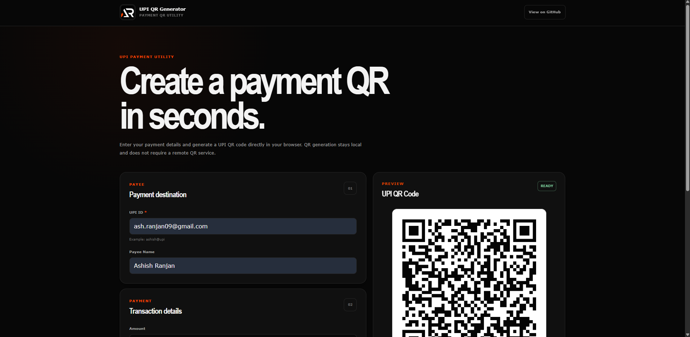

# UPI QR Generator

UPI QR Generator is a lightweight browser-based utility for creating UPI payment QR codes locally. Enter a UPI ID, payee name, amount, note, and transaction reference, then copy the payment link, download the QR as PNG, or print it.



## Live Demo

https://a2rp.github.io/upi-qr-generator/

## Features

- Local QR code generation in the browser
- No remote QR generation API
- UPI ID validation
- Optional payee name
- Optional payment amount
- Amount presets
- Optional transaction reference
- Payment note presets
- Live QR preview
- Copy UPI payment link
- Download QR as PNG
- White padding around exported QR codes
- Print-friendly QR layout
- Human-readable print date format
- Responsive desktop and mobile layout
- Accessible form controls and status messages
- Automatic copyright year
- SEO and social sharing metadata
- No framework or build step required

## Privacy

QR codes are generated directly in the browser using a local copy of the QRCode library.

Payment details are not sent to a third-party QR generation service.

## Tech Stack

- HTML5
- CSS3
- Vanilla JavaScript
- QRCode.js

## Project Structure

```text
upi-qr-generator
├── assets
│   ├── vendor
│   │   └── qrcode.min.js
│   ├── favicon.ico
│   ├── logo.png
│   └── preview.png
├── .gitignore
├── index.html
├── script.js
├── style.css
├── LICENSE
├── README.md
└── screenshot.png
```

## Run Locally

Clone the repository:

```bash
git clone https://github.com/a2rp/upi-qr-generator.git
cd upi-qr-generator
```

Start a simple local server:

```bash
python -m http.server 5500
```

Open:

```text
http://localhost:5500/
```

## UPI Payment Link

The generator creates a standard UPI payment URI similar to:

```text
upi://pay?pa=name@bank&pn=Payee&am=100.00&tn=Payment&cu=INR
```

The exact parameters depend on the values entered in the form.

## Download

The downloaded PNG includes white padding around the QR code to improve visibility and scanning reliability.

## Print

The print view includes:

- QR code
- Payee name
- UPI ID
- Amount when provided
- Transaction reference when provided
- Payment note when provided
- Date in `DD Mon YYYY` format

Browser-generated print headers and footers can be disabled from the browser print dialog.

## Deployment

This is a static project and can be deployed directly to GitHub Pages.

The live path is:

```text
https://a2rp.github.io/upi-qr-generator/
```

## Future Prospects

- Add QR size options
- Add QR color customization
- Add reusable payment templates
- Add recent locally saved payment profiles
- Add optional merchant fields
- Add installable PWA support

## License

Licensed under the [MIT License](./LICENSE).

## Links

- [Portfolio](https://www.ashishranjan.net)
- [GitHub](https://github.com/a2rp)
- [CodePen](https://codepen.io/ash1198)
- [LinkedIn](https://www.linkedin.com/in/aashishranjan)
- [Facebook](https://www.facebook.com/theash.ashish)
- [YouTube](https://www.youtube.com/channel/UCLHIBQeFQIxmRveVAjLvlbQ)
- [Email](mailto:ash.ranjan09@gmail.com)

## Support

- [Support my work](https://a2rp-donation-page.netlify.app/)
- [Buy Me a Coffee](https://buymeacoffee.com/a2rp)
- [Patreon](https://www.patreon.com/a2rp)
